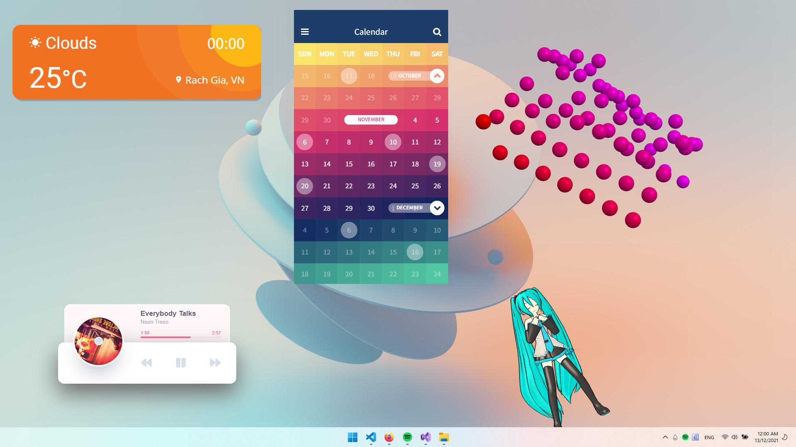
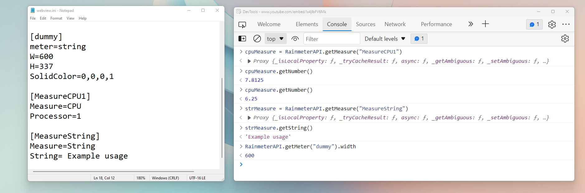

# PluginWebView
Plugin to take advantage of [Microsoft Edge WebView2](https://docs.microsoft.com/en-us/microsoft-edge/webview2/) to display web content on a skin.
- WebView window is attached into skin window so all skin configuration is respected (position, Z index, transparency,...)
- Small memory usage and extremely fast skin loading time
- Natively retrieve other Rainmeter measures' and plugins' values in JavasSript runtime
- Web renderer provides unlimited rendering capabilites. And there are massive widget resources from the internet (Codepen, CSSHint.com, ...) that you customsize and make them functional

In example skins package, I demostrated how to setup WebView plugin measure and skin window to contain WebView window correctly.

Skin "player" and "visualizer" show how `RainmeterAPI` object is used to get AudioLevel and WebNowPlaying plugins values.
Skin "visualizer", "Miku" and "Minecraft" show 3D render capability. Note that they are for fun only, 3D rendering usew too much CPU and RAM.
"visualiser" is also interactable with mouse (zoom, pan, move)

All of these widgets are downloaded from the internet, I will credit their authors properly later.



## Download
- Download Example Skins package in [Releases page](https://github.com/khanhas/PluginWebView/releases) to install skins + plugin.
- In first plugin load, it will prompt you to download and install WebView2 runtime if your Windows hasn't had it already. Click OK will open download link directly.

## Documentation
Methods and properties of JavaScript object that are binded directly to their native objects
### `RainmeterAPI`
| Type | Name | Param | Return | Description |
| :--- | :--- | :--- | :--- | :--- |
| Method |`GetMeasure` | `(sectionName: string)` | MeasureObject | Get a measure object from its name |
| Method |`GetMeter` | `(sectionName: string)` | MeterObject | Get a meter object from its name |
| Method |`GetVariable` | `(variableName: string)` | string | Get a variable value |
| Method |`GetOption` | `(optionName: string, replaceVariables: boolean)` | string | Get a option of current Plugin measure |
| Method |`GetOption` | `(optionName: string, replaceVariables: boolean)` | string | Get a option of current Plugin measure |
| Method |`Bang` | `(command: string)` | | Send bang/bangs to skin |
| Method |`Log` | `(message: string)` | | Log a Notice message |

### MeasureObject
MeasureObject returned from a `Rainmeter.GetMeasure` call has these following methods and properties:

| Type | Name | Param | Return | Description |
| :--- | :--- | :--- | :--- | :--- |
| Method |`GetString` | `()` | string | Get measure string value |
| Method |`GetNumber` | `()` | number | Get measure numberic value |
| Method |`GetOption` | `(optionName: string, replaceVariables: boolean)` | string | Get a option of measure |
| Method |`Command` | `(command: string)` | | Send a command to measure (similar to "!CommandMeasure" bang) |
| Method |`Update` | `()` | |
| Property (get, set) |`disabled` | | boolean  | Whether measure is [disabled](https://docs.rainmeter.net/manual/measures/general-options/#Disabled) |
| Property (get, set) |`paused` | | boolean | Whether measure is [paused](https://docs.rainmeter.net/manual/measures/general-options/#Paused) |
| Property (get, set) |`dynamicVariables` | | boolean | Whether measure should [re-read its options every update](https://docs.rainmeter.net/manual/variables/#DynamicVariables) |


### MeterObject
MeterObject returned from a `Rainmeter.GetMeter` call has these following methods and properties:

| Type | Name | Param | Return | Description |
| :--- | :--- | :--- | :--- | :--- |
| Method |`GetOption` | `(optionName: string, replaceVariables: boolean)` | string | Get a option of meter |
| Method |`Update` | `()` | |
| Property (get, set) |`hidden` | | boolean  | Whether meter is [hidden](https://docs.rainmeter.net/manual/meters/general-options/#Hidden) |
| Property (get, set) |`dynamicVariables` | | boolean | Whether meter should [re-read its options every update](https://docs.rainmeter.net/manual/variables/#DynamicVariables) |
| Property (get, set) |`x` | | int  | Meter X position |
| Property (get, set) |`y` | | int  | Meter Y position |
| Property (get, set) |`width` | | int | Meter width |
| Property (get, set) |`height` | | int | Meter height |




## Development
1. Clone Rainmeter repo and PluginWebView repo
```bash
git clone https://github.com/rainmeter/rainmeter
git clone https://github.com/khanhas/PluginWebView
```
2. Open Rainmeter solution in Visual Studio
3. Add PluginWebView project into Rainmeter solution
4. Build PluginWebView only, you don't need to build Rainmeter.
5. Copy WebView.dll to `%appdata\Rainmeter\Plugins`

